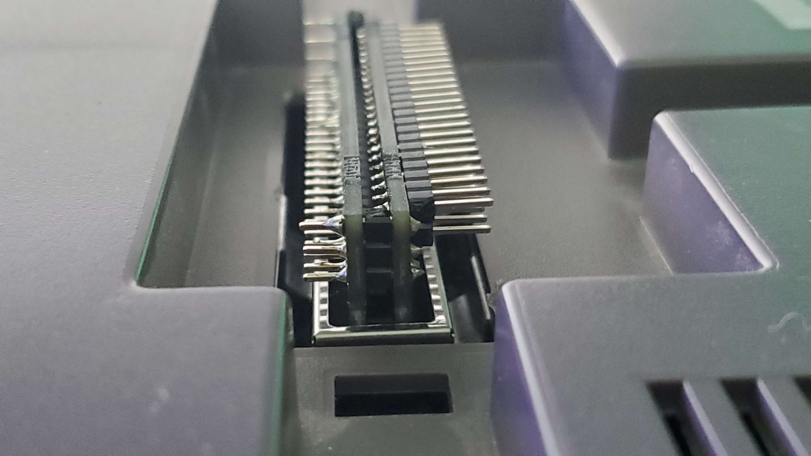
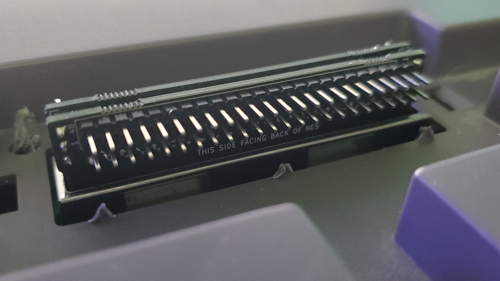
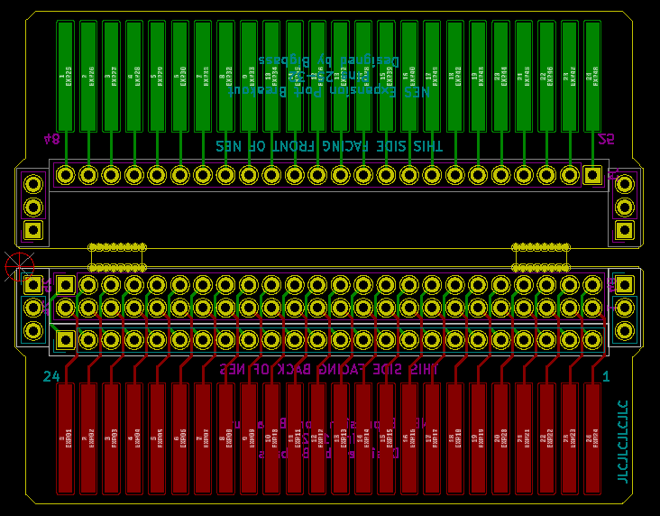

### Description
A breakout board for the NES Expansion port. The two parts of the assembly are soldered together using header pins as spacers. This will hopefully result in a tight fit allowing the NES pins to press against the pads of the breakout assembly. The single header row also acts as a bridge from one side to the other. Refer to the skilscreen printing for pin/pad numbering.

### JLCPCB Ordering
Options used: Single PCB, 1.6 thickness, HASL finish, 1oz copper weight, Gold Fingers with 45 degre chamfer, No flying probe test, and using a specified location for the order number.

You'll probably need to tell them that this is technically two designs. They charged me an extra $4 after reviewing because of this. Or else split the design into two files and submit two designed for one order.

